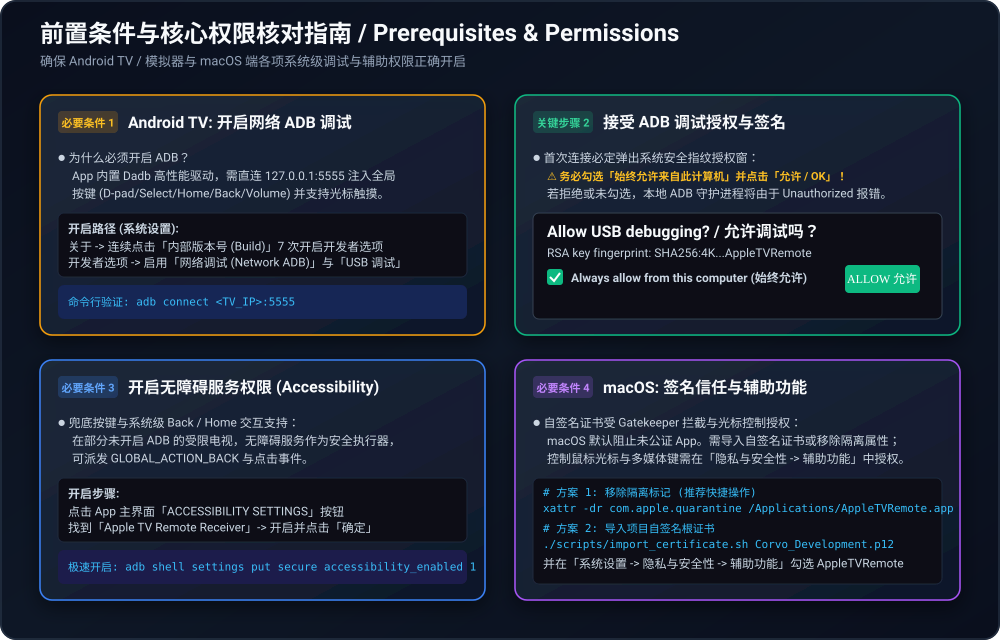
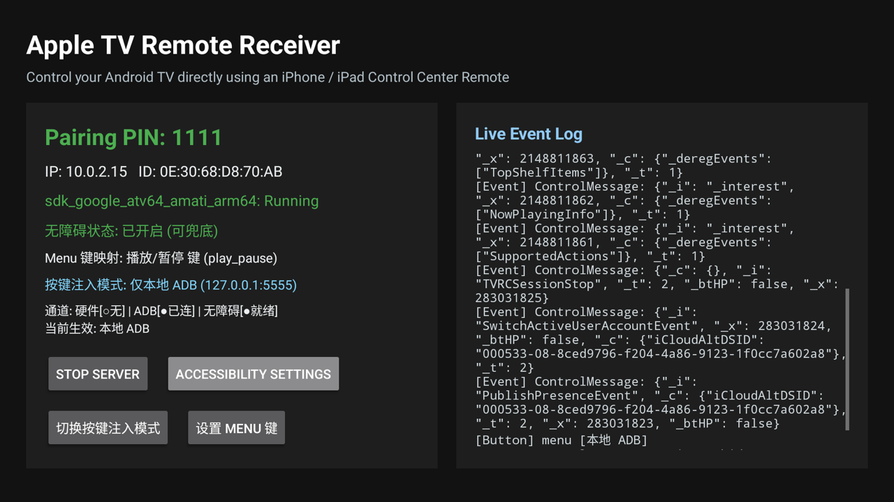
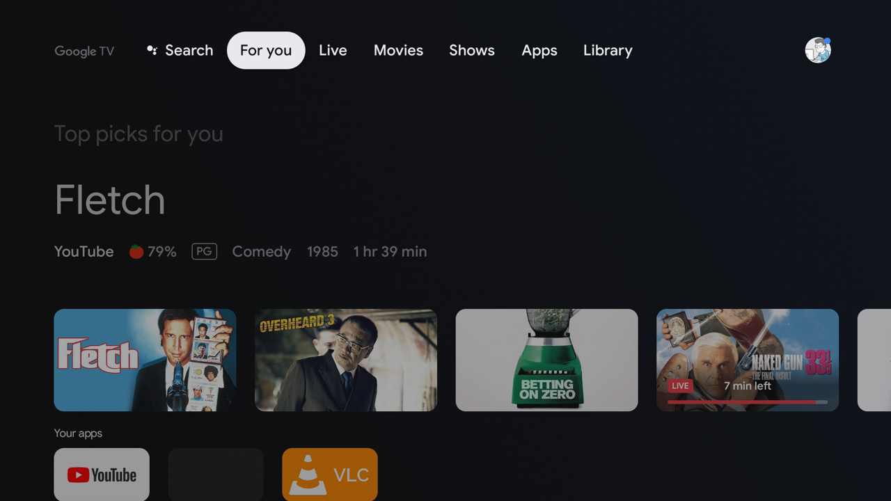
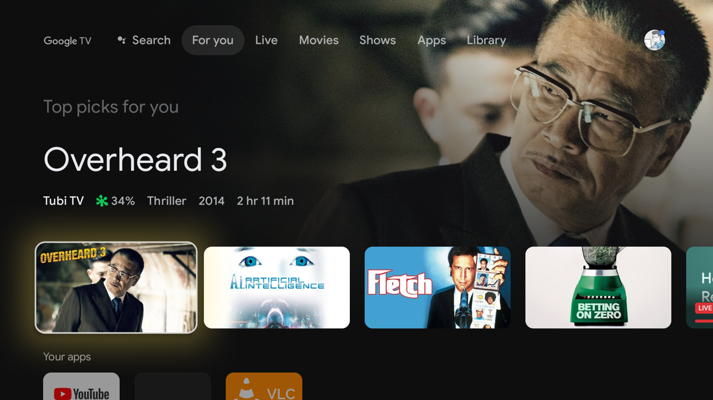
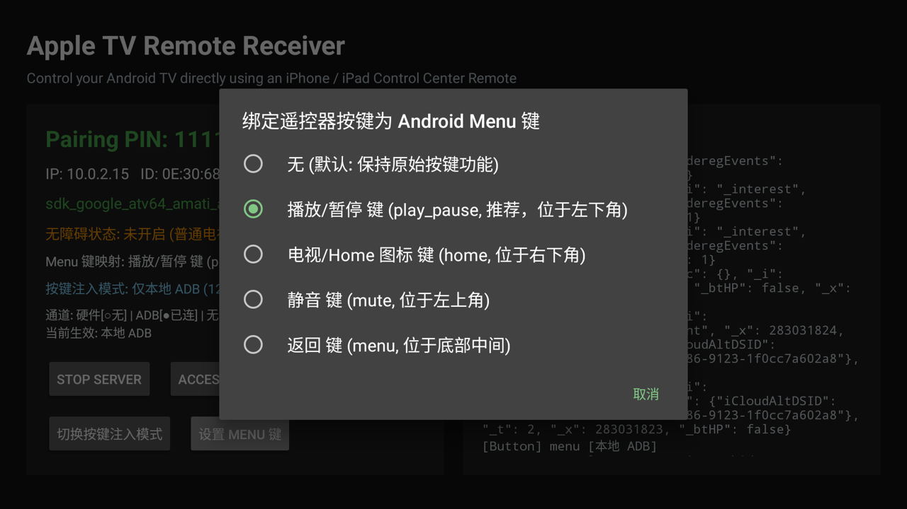
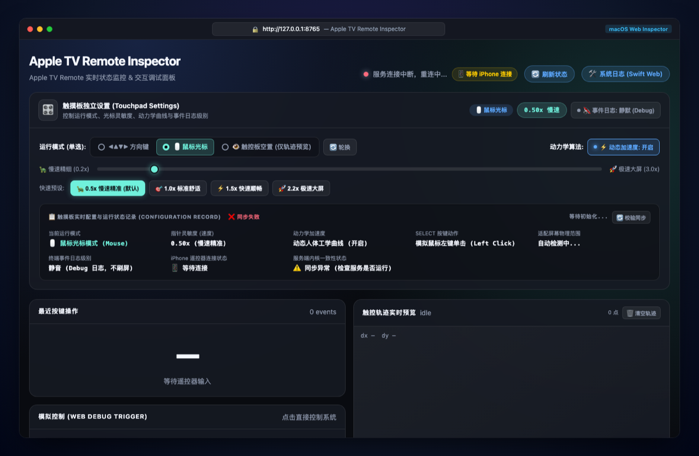

# Fake Apple TV (atv-core) 📺

> **English Version** | [中文版本](README_zh.md)

A high-performance Rust implementation of the Apple TV Companion Link and Media Remote Protocol (MRP) server. It enables real Apple devices (iPhone / iPad Control Center **Apple TV Remote**) to natively discover, pair, and control:

1. **Android TV / Google TV / Android Boxes / Emulators**:
   - **Direct Standalone APK**: Runs natively on Android TV using JNI (`atv-android`), a local zero-latency ADB daemon (`dadb`), and an Accessibility Service (`AtvAccessibilityService`).
   - **Remote Network ADB Mode**: Runs on macOS/Linux and forwards remote commands to the Android TV over network ADB.
2. **macOS (Mac mini / MacBook / iMac)**:
   - Native Swift Menu Bar App (`AppleTVRemote.app`) with ultra-smooth dynamic ballistics mouse mode, arrow keys mode, system media controls, and hardware volume sync.
   - Cross-platform CLI (`atv-cli`) for headless and automation environments.
3. **Built-in Web Inspector & Debugger**:
   - Browser-based diagnostic dashboard (`http://127.0.0.1:8765`) featuring live touchpad trajectory canvas, interactive virtual remote, volume gauges, sensitivity presets, and millisecond-level protocol event streams.

---

## Table of Contents

- [1. Architecture & Remote Page Movement](#1-architecture--remote-page-movement)
- [2. Crucial Prerequisites & Permissions (Must Read)](#2-crucial-prerequisites--permissions-must-read)
  - [Android TV Requirements (ADB & Permissions)](#android-tv-requirements-adb--permissions)
  - [macOS Requirements (Gatekeeper & Accessibility)](#macos-requirements-gatekeeper--accessibility)
  - [Network & Pairing Requirements](#network--pairing-requirements)
- [3. Android TV Page Navigation & App Experience](#3-android-tv-page-navigation--app-experience)
  - [Remote Gestures & Focus Navigation](#remote-gestures--focus-navigation)
  - [TV Dashboard & In-App Configuration](#tv-dashboard--in-app-configuration)
- [4. Android Emulator Operations & Bridge Workflow](#4-android-emulator-operations--bridge-workflow)
  - [Emulator Networking & Bridge Architecture](#emulator-networking--bridge-architecture)
  - [Step-by-Step Emulator Testing Guide](#step-by-step-emulator-testing-guide)
- [5. macOS Native App & CLI Guide](#5-macos-native-app--cli-guide)
  - [One-Click App & DMG Packaging](#one-click-app--dmg-packaging)
  - [Dynamic Modes & Trackpad Ballistics](#dynamic-modes--trackpad-ballistics)
- [6. macOS Browser Real-Time Control UI (Web Inspector)](#6-macos-browser-real-time-control-ui-web-inspector)
- [7. Protocol Key & Gesture Mapping Reference](#7-protocol-key--gesture-mapping-reference)
- [8. Troubleshooting & FAQ](#8-troubleshooting--faq)

---

## 1. Architecture & Remote Page Movement

When you open the Apple TV Remote in iOS Control Center and swipe the touchpad, micro-displacement coordinates are transmitted over a TLS-encrypted Companion Link session. `atv-core` decrypts and processes these inputs, translating them into grid focus movements on Android TV and high-precision cursor trajectories on macOS.


---

## 2. Crucial Prerequisites & Permissions (Must Read)

To ensure that touch gestures and simulated keystrokes are received and dispatched properly, please verify the following prerequisites before your first run:



### Android TV Requirements (ADB & Permissions)

#### 1. Enable Developer Options & Network ADB
* **Why must ADB be enabled?**
  * Android TV sandboxes third-party apps, preventing them from simulating global physical hardware keys (D-pad Up/Down/Left/Right, Home, Back, Volume) across the desktop and other apps.
  * The app includes an embedded high-performance `dadb` client that connects locally to `127.0.0.1:5555`. This achieves **sub-8ms latency** global key injection without requiring root. **If ADB is disabled, system-wide key injection will fail.**
* **How to enable**:
  1. Go to **Settings -> Device Preferences -> About** (or **System -> About** on Google TV).
  2. Scroll to **Build Number** and click it **7 times** until you see the message: *"You are now a developer!"*.
  3. Return to the previous menu, enter **Developer Options**.
  4. Enable **USB Debugging** and **Network ADB Debugging**.

#### 2. Accept the ADB RSA Authorization Prompt
The first time the app attempts to establish the internal ADB connection, a system security dialog will appear on your TV screen:


> ⚠️ **CRITICAL STEP**:
> Using your TV remote, check the box: **"Always allow from this computer"**, then select **"Allow" / "OK"**.
> If you cancel or dismiss this prompt, the internal ADB client will fail with an `Unauthorized` error.

#### 3. Enable Accessibility Service Permission
* **Purpose**: Dispatches global system actions (`GLOBAL_ACTION_BACK`, `GLOBAL_ACTION_HOME`, power dialog) and provides a non-ADB fallback navigation channel.
* **How to enable**:
  1. Click **"ACCESSIBILITY SETTINGS"** in the app's main dashboard.
  2. Locate **Apple TV Remote Receiver** under Services (shown as *Off* by default).
  3. Select it, toggle it **On**, and click **OK** in the system permission confirmation dialog.

| 1. Services List | 2. Permission Confirmation | 3. Ready Status |
| :---: | :---: | :---: |
|  |  |  |

---

### macOS Requirements (Gatekeeper & Accessibility)

#### 1. Gatekeeper & Self-Signed Certificate Approval
Official release binaries and DMGs are signed with a private development certificate (`Corvo Development`). On another Mac, macOS Gatekeeper will block the app with *"Apple cannot check it for malicious software"*.

Resolve this with either option:

* **Option A (Recommended)**: Import the included self-signed certificate into your macOS Keychain:
  ```bash
  ./scripts/import_certificate.sh Corvo_Development.p12
  ```
* **Option B (Quick Quarantine Removal)**: Remove the quarantine flag from the app:
  ```bash
  xattr -dr com.apple.quarantine /Applications/AppleTVRemote.app
  ```
  *(Alternatively: Right-click `AppleTVRemote.app` in Finder, hold `Option` or `Control`, select "Open", and click "Open" in the prompt).*

#### 2. Grant macOS Accessibility Permissions
Simulating keyboard and mouse events (`CGEvent`) requires Accessibility permission:
1. Open **System Settings -> Privacy & Security -> Accessibility**.
2. Ensure **AppleTVRemote** is enabled (or enable your terminal app like **Terminal** or **iTerm2** if running `atv-cli`).

---

### Network & Pairing Requirements

1. **Same Local Network (LAN / Subnet)**: Your iPhone/iPad and Android TV / Mac must be connected to the same Wi-Fi network (2.4 GHz and 5 GHz bands can communicate).
2. **Disable AP Isolation**: Ensure your Wi-Fi router does not have "AP Isolation" or "Guest Isolation" enabled, which blocks local mDNS (Bonjour UDP 5353) broadcasts.
3. **Pairing PIN**: When prompted on your iPhone, enter the 4-digit pairing PIN shown on your TV screen (default: **`1111`**).

---

## 3. Android TV Page Navigation & App Experience

### Remote Gestures & Focus Navigation

On the Android TV / Google TV home screen, swiping the touchpad on your iPhone translates directly into grid focus movement across UI components:

```
[Top Navigation Bar (For you / Live / Apps)]
                 ↕ (Swipe Down)
[Featured Hero Media Card (e.g., Fletch)]
                 ↕ (Swipe Down)
[Application Dock Row (YouTube / VLC / Settings)]
```

| 1. Top Navigation Bar Focus | 2. Featured Content Hero Focus | 3. App Dock Grid Focus |
| :---: | :---: | :---: |
|  |  |  |

* **Tap / Click SELECT (Touchpad Center)**: Opens the currently focused application or plays media.
* **Back Button (`<`)**: Returns to previous screen.
* **Home Button (TV Icon)**: Instantly returns to the Leanback launcher home screen.

---

### TV Dashboard & In-App Configuration

Opening the receiver app directly on your TV displays a real-time status monitor and configuration options:

| Receiver Main Dashboard | Key Injection Mode Selection | Menu Key Rebinding Dialog |
| :---: | :---: | :---: |
|  |  |  |

* **Live Multi-Channel Status**:
  * **Hardware**: Checks for direct `/dev/input/event*` devices.
  * **ADB**: Confirms the local `127.0.0.1:5555` dadb connection is active.
  * **Accessibility**: Confirms the background service is running.
* **Key Injection Strategies**:
  * Easily toggle between `Local ADB Only`, `Accessibility Only`, `ADB Preferred (A11y Fallback)`, and `Hardware Preferred`.
* **Custom Android Menu Key Binding**:
  * Since Apple TV Remotes do not have a dedicated Android `Menu` key, you can rebind the Play/Pause, Home, or Mute button to trigger `KEYCODE_MENU`.

---

## 4. Android Emulator Operations & Bridge Workflow

If you do not have a physical Android TV or want to develop and test locally, you can use the Android Studio Android TV Emulator (AVD).

### Emulator Networking & Bridge Architecture

Android emulators run inside a private host-only NAT network (virtual IP `10.0.2.15`). Physical devices on your Wi-Fi (such as your iPhone) cannot directly reach or discover this virtual network.

The project provides an automated bridge suite: **`scripts/bridge_emulator.py`**:


1. **Port Forwarding**: Establishes `adb forward` tunnels for ports `49152` (MRP), `49153` (Companion Link), and `49154` (AirPlay).
2. **Host mDNS Proxy**: Automatically advertises `_mediaremotetv._tcp` and `_companion-link._tcp` on your Mac's physical Wi-Fi interface.
3. **Seamless Pairing**: Your iPhone discovers "Android TV Emulator" as if it were a physical Apple TV on your desk.

---

### Step-by-Step Emulator Testing Guide

#### Step 1: Start the Android TV Emulator
Launch any Android TV or Google TV AVD image (Android 11+ / API 30+ recommended) via Android Studio Device Manager, or via CLI:
```bash
emulator -avd <Your_AVD_Name>
```
Verify that `adb devices` lists the emulator (typically `emulator-5554`).

#### Step 2: Build & Install the App
```bash
# Cross-compile native Rust cdylib and build APK
./scripts/build_android.sh
adb -s emulator-5554 install -r android-tv/app/build/outputs/apk/debug/app-debug.apk

# Launch the app on emulator
adb -s emulator-5554 shell am start -n com.corvofeng.fakeatv/.MainActivity
```

#### Step 3: Start the Bridge Service
```bash
# Start background bridge daemon
python3 scripts/bridge_emulator.py start

# Or run in foreground with verbose output
python3 scripts/bridge_emulator.py start -f
```

* Bridge management commands:
  ```bash
  python3 scripts/bridge_emulator.py status    # Check ports & mDNS status
  python3 scripts/bridge_emulator.py logs -f   # Stream bridge logs
  python3 scripts/bridge_emulator.py stop      # Terminate bridge daemon
  ```

#### Step 4: Discover & Control on iPhone
1. Connect your iPhone to the same Wi-Fi network as your Mac.
2. Swipe down to open iOS Control Center and tap the **Apple TV Remote** icon.
3. Select **Android TV Emulator** from the device list.
4. Enter PIN **`1111`** to complete pairing and start controlling the emulator!

---

## 5. macOS Native App & CLI Guide

Transform your Mac mini or MacBook into an Apple TV target:

```bash
# Build standalone DMG package
./scripts/build_dmg.sh
```

Mount `build/AppleTVRemote-arm64.dmg` and drag the application to `/Applications`:

* **Lightweight Menu Bar Agent**: Native Swift AppKit architecture consuming under 20MB RAM.
* **Dual-Mode Control (Directional vs Smooth Mouse)**:
  * **Smooth Mouse Mode**: Ergonomic dynamic ballistics curve with sub-pixel precision for subtle motions and up to 4.5x acceleration for flick gestures across dual 4K displays.
  * **Directional Mode**: Precise `↑` `↓` `←` `→` arrow keys and Enter.
  * **Instant Mode Switching**: Press the remote's **Siri button** or switch in the Web Inspector. An OS-native notification banner will display on your Mac.
* **Multimedia & Volume Integration**:
  * **Single-click ⏯**: Play / Pause (interacts with macOS Now Playing for Apple Music, Spotify, Safari, YouTube, Bilibili, IINA).
  * **Double-click ⏯**: Next Track (⏭).
  * **Triple-click ⏯**: Previous Track (⏮).
  * **Volume +/- & Mute**: Native translucent macOS volume HUD and bidirectional volume state synchronization.

---

## 6. macOS Browser Real-Time Control UI (Web Inspector)

When running on macOS, access the built-in diagnostic and remote control web consoles directly in your browser:

* **Core Web Inspector (Touchpad & Remote)**: 👉 **`http://127.0.0.1:8765`**
* **Swift Host Diagnostics & Runtime Logs**: 👉 **`http://127.0.0.1:8766`**

### 1. macOS Browser UI Mockup (Web Inspector)



### 2. macOS Swift Host Diagnostics Web Page


### Features & Capabilities:
* **Live Touchpad Canvas**: Visualizes finger coordinates, touch phases (`Began`, `Moved`, `Ended`), velocity, and relative displacement (`dx`, `dy`).
* **Virtual Remote Controller**: Click virtual D-pad buttons, volume, and playback controls directly on your browser without reaching for your phone.
* **Dynamic Sensitivity & Ballistics Controls**: Adjust mouse speed from 0.2x to 3.0x, select speed presets (`0.5x Precise`, `1.0x Standard`, `1.5x Fast`, `2.2x Ultra`), and toggle dynamic acceleration curves.
* **Server-Sent Events (SSE) Protocol Stream**: Inspect raw encryption handshakes, session milestones, and keystroke events in real time.

---

## 7. Protocol Key & Gesture Mapping Reference

| Apple TV Remote Action | Android TV Action | macOS (Mac mini / MacBook) Action |
| :--- | :--- | :--- |
| **Trackpad Swipe (D-pad Mode)** | `KEYCODE_DPAD_UP` / `DOWN` / `LEFT` / `RIGHT` | Arrow Keys `↑` `↓` `←` `→` |
| **Trackpad Swipe (Mouse Mode)** | Simulated Touch Drag / Pointer | Smooth Cursor (`CGEvent`) with Ballistics |
| **Tap / Press SELECT** | `KEYCODE_DPAD_CENTER` / Click | Enter (Return) / Left Mouse Click |
| **Back Button (`<`)** | `GLOBAL_ACTION_BACK` (`KEYCODE_BACK`) | `Escape` Key |
| **TV / Home Button** | `GLOBAL_ACTION_HOME` (`KEYCODE_HOME`) | Return to Desktop / Custom Action |
| **Single-click ⏯** | `KEYCODE_MEDIA_PLAY_PAUSE` | System Media Play / Pause (`NX_KEYTYPE_PLAY`) |
| **Double-click ⏯** | Next Episode / Fast Forward | Next Track (⏭) |
| **Triple-click ⏯** | Previous Episode / Rewind | Previous Track (⏮) |
| **Volume Up / Down (`+/-`)** | `KEYCODE_VOLUME_UP` / `DOWN` | Hardware Volume Output + System HUD |
| **Mute Button** | `KEYCODE_VOLUME_MUTE` | System Mute Toggle |
| **Side Siri Button** | Voice Search (`KEYCODE_SEARCH`) | Mode Switch (Mouse ⇄ D-pad) or Siri |
| **Power Button** | `GLOBAL_ACTION_POWER_DIALOG` | Display Sleep (`pmset`) / Wake |

---

## 8. Troubleshooting & FAQ

### Q1: The device does not appear in iPhone Control Center.
1. Ensure both devices are on the exact same Wi-Fi subnet.
2. Verify Bonjour advertising with `dns-sd -B _mediaremotetv._tcp` on macOS.
3. For Android TV Emulator, make sure `python3 scripts/bridge_emulator.py start` is running.

### Q2: Android TV does not respond to remote inputs; logs show ADB connection errors.
1. Go to TV **Developer Options** and ensure **Network ADB Debugging** is turned on.
2. Watch the TV screen closely for the system RSA key fingerprint prompt: **check "Always allow" and click "Allow"**.
3. If no prompt appears, manually authenticate once by running `adb connect <TV_IP>:5555` from your computer.

### Q3: The TV does not have an Accessibility settings menu.
Some regional TV ROMs hide the Accessibility page. You can enable the service via ADB:
```bash
adb shell settings put secure enabled_accessibility_services com.corvofeng.fakeatv/.AtvAccessibilityService
adb shell settings put secure accessibility_enabled 1
```

### Q4: macOS shows "App is damaged and can't be opened".
Remove the Gatekeeper quarantine attribute:
```bash
xattr -dr com.apple.quarantine /Applications/AppleTVRemote.app
```
Or import the project's self-signed certificate into your Keychain:
```bash
./scripts/import_certificate.sh Corvo_Development.p12
```

---

## License

This project is licensed under the MIT License.
