# Fake Apple TV (atv-core) 📺

> **English Version** | [中文版本](README_zh.md)

High-performance Rust implementation of the Apple TV Companion Link and MediaRemote (MRP) protocols. Discover, pair, and control targets directly using the native **Apple TV Remote** widget in iOS / iPadOS Control Center without jailbreak or dedicated hardware:

1. **macOS (Mac mini / MacBook / iMac)**:
   - Native Swift menu bar app (`AppleTVRemote.app`) and cross-platform CLI.
   - **Ultra-smooth adaptive dynamic acceleration mouse cursor** and **D-pad** dual-mode seamless switching, with native hardware media key and volume control integration.
   - Built-in **Web Inspector** and **Swift Host Diagnostics** dashboards, delivering real-time visualization of touchpad gestures, hardware volume levels, and millisecond-level protocol events.
2. **Android TV / Google TV / TV Boxes / Emulators**:
   - **Native Standalone APK**: Driven by JNI + embedded ADB (`dadb`) + Android Accessibility Service (`AtvAccessibilityService`), auto-starts on boot with independent mDNS broadcasting.
   - **Remote Network ADB Mode**: Run the daemon on a Mac mini or PC, forwarding remote keys and swipes over TCP ADB in real time.

---

## Table of Contents

- [I. Live Interfaces & Real-World Showcase](#i-live-interfaces--real-world-showcase)
  - [1. macOS & iOS Interactive Interfaces](#1-macos--ios-interactive-interfaces)
    - [① iOS Remote Directly Controlling macOS](#-ios-remote-directly-controlling-macos)
    - [② macOS Web Inspector (Port 8765)](#-macos-web-inspector-port-8765)
    - [③ macOS Swift Host Diagnostics & Runtime Logs (Port 8766)](#-macos-swift-host-diagnostics--runtime-logs-port-8766)
    - [④ macOS Native Menu Bar App & Key Features](#-macos-native-menu-bar-app--key-features)
  - [2. Android TV Interfaces & Remote Navigation](#2-android-tv-interfaces--remote-navigation)
    - [① Control Dashboard & Configuration Dialogs](#-control-dashboard--configuration-dialogs)
    - [② Android TV Launcher Gesture & Focus Movement](#-android-tv-launcher-gesture--focus-movement)
- [II. Prerequisites & Permissions Checklist (Essential)](#ii-prerequisites--permissions-checklist-essential)
  - [1. macOS Prerequisites & Gatekeeper Clearance](#1-macos-prerequisites--gatekeeper-clearance)
  - [2. Android TV Prerequisites & Critical Permissions](#2-android-tv-prerequisites--critical-permissions)
  - [3. LAN & Network Pairing Requirements](#3-lan--network-pairing-requirements)
- [III. Quick Start & Operational Guides](#iii-quick-start--operational-guides)
  - [1. Running on macOS](#1-running-on-macos)
  - [2. Running on Android TV](#2-running-on-android-tv)
  - [3. Android Emulator Bridge Setup](#3-android-emulator-bridge-setup)
- [IV. Implementation Principles & Architecture](#iv-implementation-principles--architecture)
  - [1. Touchpad Gestures & Focus Accumulation Algorithm](#1-touchpad-gestures--focus-accumulation-algorithm)
  - [2. Emulator Bridge Architecture & mDNS Topology](#2-emulator-bridge-architecture--mdns-topology)
  - [3. Driver Dispatch Hierarchy & Security Sandboxing](#3-driver-dispatch-hierarchy--security-sandboxing)
- [V. Key & Gesture Mapping Reference](#v-key--gesture-mapping-reference)
- [VI. Troubleshooting & FAQ](#vi-troubleshooting--faq)

---

## I. Live Interfaces & Real-World Showcase

### 1. macOS & iOS Interactive Interfaces

#### ① iOS Remote Directly Controlling macOS
No third-party iOS app required. Simply pull down the iOS Control Center and tap the native **Apple TV Remote** icon to immediately discover the host Mac (as shown below, connected directly to `Yuhao's MacBook (2)`):

<div align="center">
  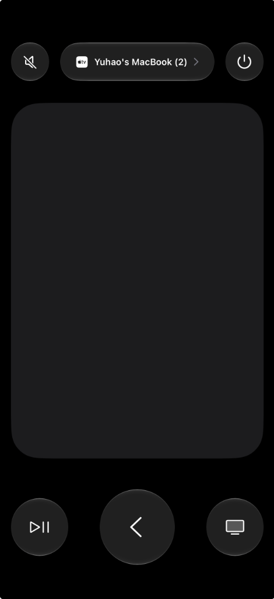
</div>

* **Full Touch Surface Support**: The expansive touch area supports micro-pixel dragging, rapid swipes, tap-to-select, and edge gestures.
* **Hardware Controls & Direct Feedback**:
  * **Play / Pause (`⏯`)**: Natively linked with macOS system-wide media playback.
  * **Back Chevron (`<`)**: Mapped to macOS `Escape` key.
  * **TV Icon (`TV`)**: Triggers configurable desktop actions or Mission Control.
  * **Hardware Volume & Mute**: The iPhone's physical volume rocker triggers macOS hardware volume with native HUD feedback.
  * **Siri / Mic Key**: Instantly toggles between **Dynamic Mouse Cursor** and **D-pad** modes.

---

#### ② macOS Web Inspector (Port 8765)
When running the daemon or menu bar app on macOS, visit **`http://127.0.0.1:8765`** in your browser to open the interactive inspection console (captured live with active finger swipe vectors and event logs):

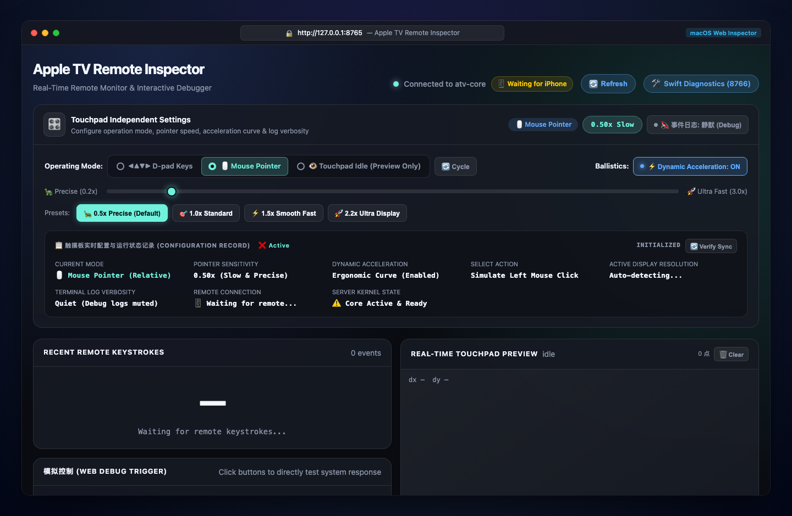

* **Real-time Touch Vector Canvas**: High-frequency rendering of finger coordinates, gesture lifecycle phases (`Began`, `Moved`, `Ended`), velocity vectors, and direction detection.
* **Interactive Virtual Remote**: Click virtual buttons directly on the web page to test Mac or TV responses without holding a phone.
* **Ballistics & Sensitivity Presets**: Instant switching between `0.5x Precise`, `1.0x Standard`, `1.5x Fast`, and `2.2x Ultra-Wide Screen` dynamics profiles.
* **Connected Device & Volume Telemetry**: Displays connected remote device metadata and live volume feedback.

---

#### ③ macOS Swift Host Diagnostics & Runtime Logs (Port 8766)
Navigate to **`http://127.0.0.1:8766`** to inspect the Swift host process health, active port bindings, and live protocol handshakes:

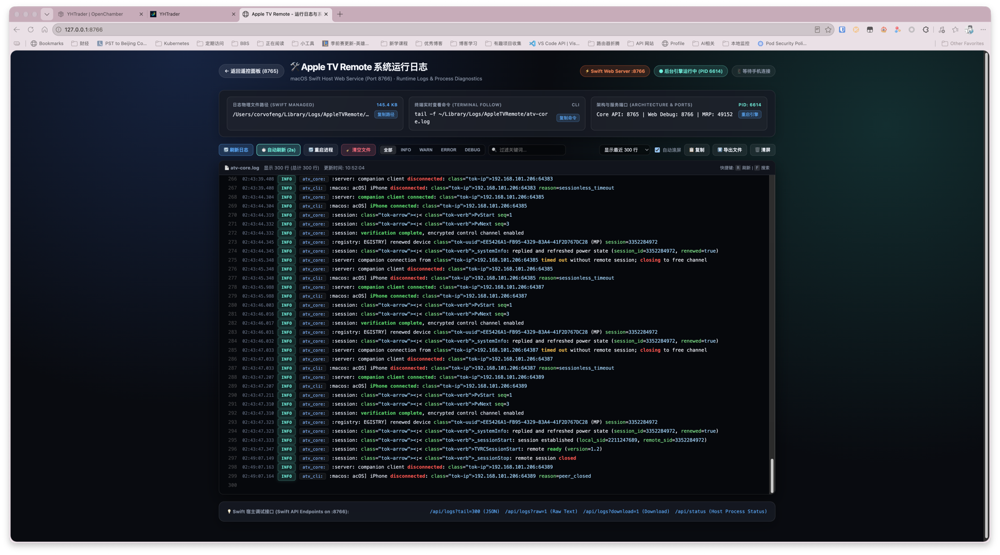

* **Real-time Session Tracing**: Live stream of Companion client connections (e.g., iPhone at `192.168.101.206`), SRP authentication, and MRP encrypted control channel initialization.
* **Process Telemetry**: Live indicators for Core API port (`8765`), Web Debug port (`8766`), MediaRemote port (`49152`), background PID, text search filter, and process restart controls.

---

#### ④ macOS Native Menu Bar App & Key Features
Running `AppleTVRemote.app` places a lightweight native Swift icon in the macOS menu bar, consuming as little as 18MB of RAM:

* **Cursor & D-Pad Hot Switching**:
  * **Mouse Cursor Mode**: Ergonomic non-linear acceleration curve for pinpoint precision and rapid multi-monitor travel.
  * **D-Pad Directional Mode**: Dispatches arrow keys `↑` `↓` `←` `→` and `Enter`.
  * **Mode Toggle**: Press the remote's **Siri** button or click on the Web Inspector—macOS displays an instant native notification banner!
* **Deep Media Key Integration**:
  * **Single Click ⏯**: Play / Pause (native `NX_KEYTYPE_PLAY` for YouTube, Safari, Spotify, IINA, etc.).
  * **Double Click ⏯**: Next Track (⏭).
  * **Triple Click ⏯**: Previous Track (⏮).
  * **Volume Up / Down / Mute**: Directly controls system master output volume with the native macOS HUD.

---

### 2. Android TV Interfaces & Remote Navigation

#### ① Control Dashboard & Configuration Dialogs
Launch the app on Android TV to monitor driver status and customize key bindings:

| Main Dashboard | Input Injection Mode | Menu Key Binding |
| :---: | :---: | :---: |
| 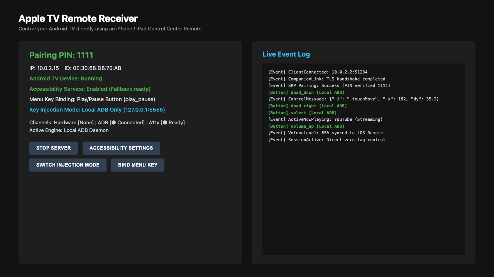 | 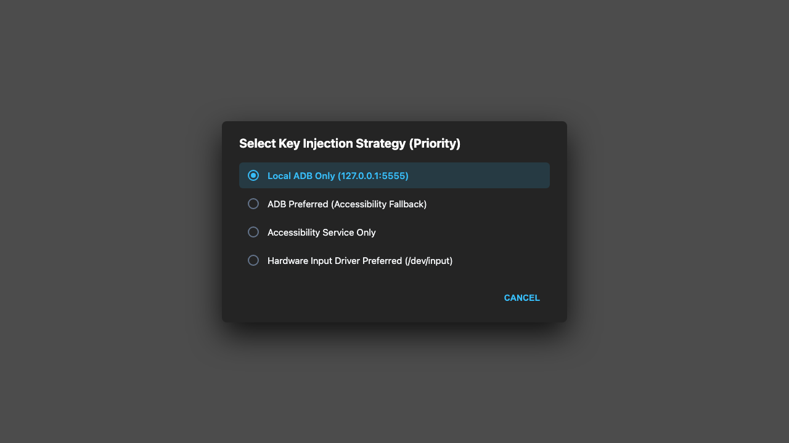 | 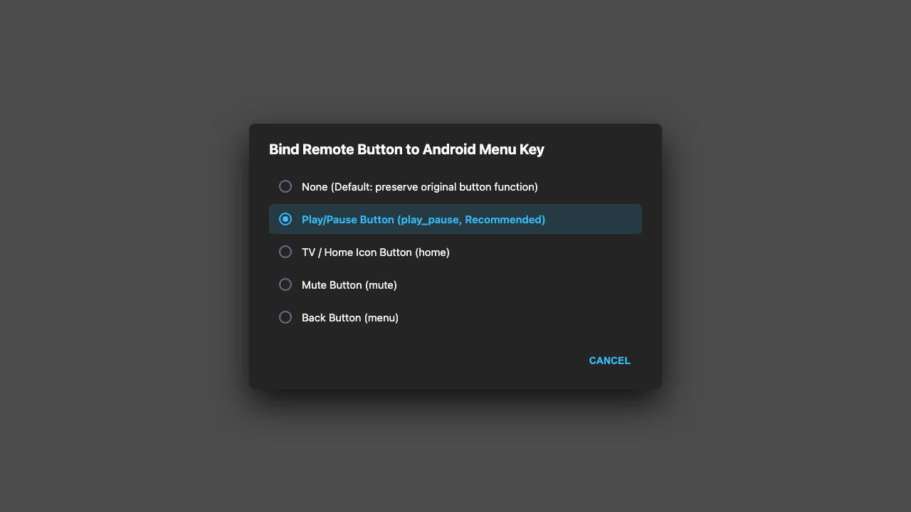 |

* **Triple-Channel Driver Health**: Real-time status indicators for `/dev/input/event*` hardware drivers, local Dadb daemon (`127.0.0.1:5555`), and `AtvAccessibilityService`.
* **Input Injection Strategy**: Select between *Local ADB Only*, *Accessibility Service Only*, *ADB Preferred (Fallback to Accessibility)*, or *Hardware Preferred*.
* **Menu Key Rebinding**: Remap Play/Pause, Home, or Mute to the Android system `KEYCODE_MENU` for legacy TV apps.

---

#### ② Android TV Launcher Gesture & Focus Movement
Swiping on the iPhone touchpad smoothly shifts the TV focus highlight across the UI grid:

```
[Top Navigation Tabs (For you / Apps)]
              ↕ (Swipe Down)
[Featured Hero Banner Focus]
              ↕ (Swipe Down)
[Application Row (YouTube / VLC / Settings)]
```

| 1. Top Navigation Focus | 2. Hero Banner Focus | 3. App Card Row Focus |
| :---: | :---: | :---: |
|  |  | 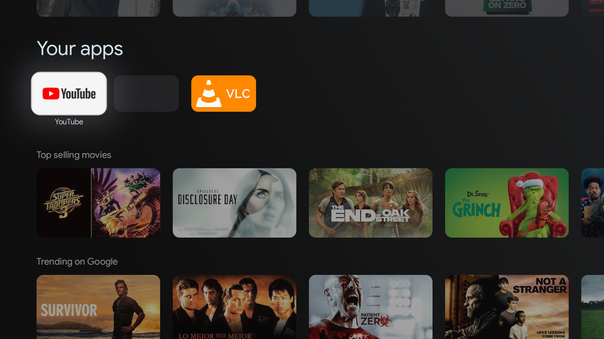 |

* **Tap or Click Center SELECT**: Open the selected card or stream immediately.
* **Back Chevron `<`**: Return to previous screen (`GLOBAL_ACTION_BACK`).
* **TV Icon `Home`**: Instantly return to the Android TV launcher home screen.

---

## II. Prerequisites & Permissions Checklist (Essential)

Review the following system requirements before initial launch:

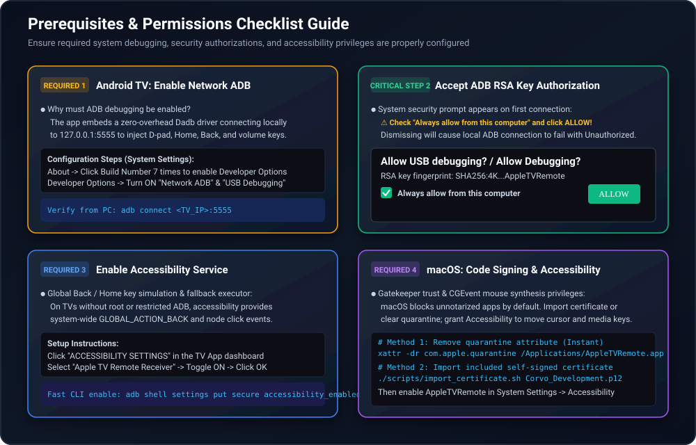

### 1. macOS Prerequisites & Gatekeeper Clearance

#### ① Gatekeeper & Self-Signed Certificate
Release builds are signed with a dedicated developer certificate (`Corvo Development`). On macOS, Gatekeeper may flag untrusted apps:

* **Option A (Recommended)**: Import the certificate into system Keychain:
  ```bash
  ./scripts/import_certificate.sh Corvo_Development.p12
  ```
* **Option B (Quick Bypass)**: Strip the quarantine attribute:
  ```bash
  xattr -dr com.apple.quarantine /Applications/AppleTVRemote.app
  ```
  *(Or right-click the app in Finder while holding `Control`, select Open, and confirm.)*

#### ② Accessibility Permission
Simulating keyboard strokes and smooth mouse cursor movements requires macOS Accessibility permissions:
1. Navigate to **System Settings -> Privacy & Security -> Accessibility**.
2. Enable **AppleTVRemote** (or your terminal application like **Terminal** / **iTerm** if running via CLI).

---

### 2. Android TV Prerequisites & Critical Permissions

#### ① Enable Network ADB & USB Debugging
* **Why is ADB required?**
  * Android security policies prevent regular apps from injecting global D-Pad and Select keys across third-party streaming apps.
  * Embedded Dadb connects directly to `127.0.0.1:5555` to dispatch Linux keycodes with **<8ms ultra-low latency**.
* **Setup Steps**:
  1. Open TV **Settings -> About**.
  2. Click **Build Number** 7 times until developer mode is unlocked.
  3. Return to **Settings -> System -> Developer Options**.
  4. Enable **USB Debugging** and **Network Debugging**.

#### ② Accept ADB RSA Fingerprint Authorization
When the app initializes the local Dadb connection, an Android system security prompt will appear:

> ⚠️ **CRITICAL**:
> Using your physical TV remote, check **"Always allow from this computer"** and click **"Allow / OK"**.
> Rejecting this prompt will cause `Unauthorized` connection errors and prevent remote input.

#### ③ Enable Accessibility Service
* **Purpose**: Serves as a fallback input channel and handles system-level global actions (`GLOBAL_ACTION_BACK`, `GLOBAL_ACTION_HOME`).
* **Setup Steps**:
  1. Click **ACCESSIBILITY SETTINGS** on the main dashboard.
  2. Locate **Apple TV Remote Receiver** (shows "Off" by default).
  3. Turn it On and confirm in the system permission dialog.

| Step 1: Accessibility List | Step 2: Confirmation Dialog | Step 3: Service Ready |
| :---: | :---: | :---: |
|  | 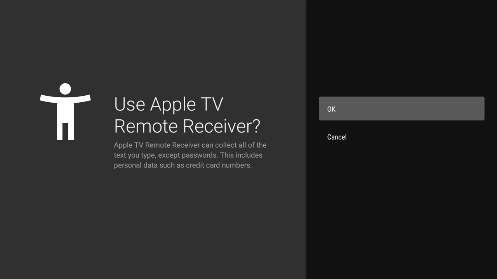 |  |

---

### 3. LAN & Network Pairing Requirements

1. **Same Wi-Fi Subnet**: The iPhone and TV / Mac must share the same local router subnet (2.4G and 5G bands are compatible).
2. **Disable AP Isolation**: Commercial routers with "AP Isolation" or "Guest Mode" block UDP 5353 Bonjour multicast packets. Ensure client-to-client communication is permitted.
3. **Initial Pairing PIN**: When connecting from the iPhone Control Center, enter the default PIN **`1111`** to complete the SRP cryptographic handshake.

---

## III. Quick Start & Operational Guides

### 1. Running on macOS

```bash
# Build standalone DMG package
./scripts/build_dmg.sh
```

Mount `build/AppleTVRemote-arm64.dmg` and drag the application to `/Applications`. Launch the app and access controls via the menu bar icon.

---

### 2. Running on Android TV

```bash
# Build and install APK
./scripts/build_android.sh
adb install -r android-tv/app/build/outputs/apk/debug/app-debug.apk

# Launch app
adb shell am start -n com.corvofeng.fakeatv/.MainActivity
```

---

### 3. Android Emulator Bridge Setup

For testing inside Android Studio's Android TV Virtual Devices (AVD):

#### Step 1: Launch Emulator
Start an Android TV AVD (API 30+ recommended). Run `adb devices` to verify `emulator-5554` is online.

#### Step 2: Install and Launch Receiver
```bash
./scripts/build_android.sh
adb -s emulator-5554 install -r android-tv/app/build/outputs/apk/debug/app-debug.apk
adb -s emulator-5554 shell am start -n com.corvofeng.fakeatv/.MainActivity
```

#### Step 3: Start Bridge Daemon
```bash
# Start background daemon
python3 scripts/bridge_emulator.py start

# Or run foreground with live logs
python3 scripts/bridge_emulator.py start -f
```

* Useful management commands:
  ```bash
  python3 scripts/bridge_emulator.py status    # Check port forwarding & mDNS state
  python3 scripts/bridge_emulator.py logs -f   # Tail bridge logs
  python3 scripts/bridge_emulator.py stop      # Stop bridge daemon
  ```

#### Step 4: Pair from iPhone
1. Connect iPhone to the same Wi-Fi as your Mac.
2. Open iOS Control Center -> Apple TV Remote.
3. Select **`Android TV Emulator`**.
4. Enter default PIN **`1111`** to start controlling the emulator!

---

## IV. Implementation Principles & Architecture

### 1. Touchpad Gestures & Focus Accumulation Algorithm

When swiping on the iPhone touchpad, the Companion Link protocol streams high-frequency differential delta coordinates. `atv-core` converts these inputs into smooth grid focus shifts on Android TV and ergonomic cursor acceleration on macOS:

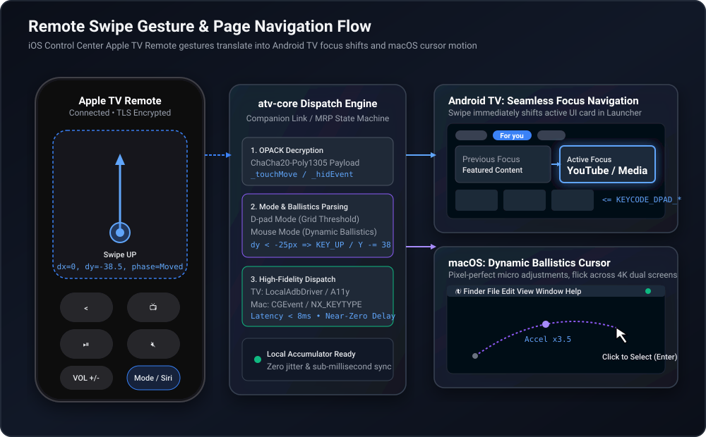

1. **Delta Accumulator**: Aggregates continuous micro-displacements to prevent jitter and accidental touches.
2. **Direction Deadzone & Thresholds**: Determines primary intent (horizontal vs. vertical) while filtering diagonal noise.
3. **Platform Dispatch**:
   - **Android TV**: Emits `KEYCODE_DPAD_UP/DOWN/LEFT/RIGHT` focus events.
   - **macOS**: Computes velocity-based ballistics curves and emits smooth cursor motion via `CGEvent`.

---

### 2. Emulator Bridge Architecture & mDNS Topology

Because the Android emulator runs within an isolated host NAT subnet (fixed virtual IP `10.0.2.15`), local physical devices cannot discover it directly:

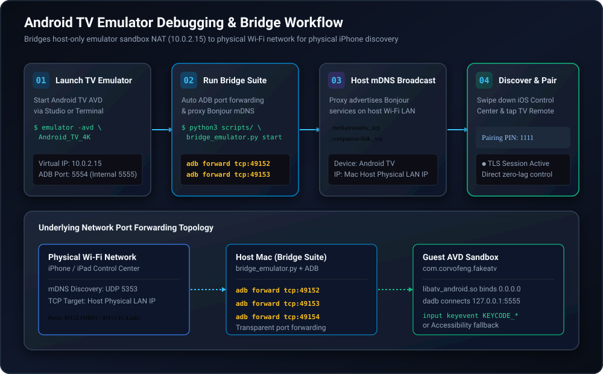

1. **ADB Port Forwarding**: Ports `49152`, `49153`, and `49154` are forwarded directly into the emulator guest OS via `adb forward`.
2. **mDNS Host Proxy**: The host proxies Bonjour records (`_mediaremotetv._tcp` and `_companion-link._tcp`) onto the physical Wi-Fi network.
3. **Transparent Connection**: The iPhone connects directly to the host's LAN IP, seamlessly routed to the emulator.

---

### 3. Driver Dispatch Hierarchy & Security Sandboxing

`atv-core` uses a layered driver strategy to ensure lowest possible latency and dependable fallback:


* **Android Dispatch**:
  * **Primary (Dadb)**: Local loopback to `127.0.0.1:5555` for direct Linux input keycode dispatch (`<8ms` latency).
  * **Fallback (Accessibility)**: Handles global window events (`GLOBAL_ACTION_BACK`, `GLOBAL_ACTION_HOME`).
* **macOS Dispatch**:
  * **Accessibility API (`CGEvent`)**: Drives mouse motion, ballistics acceleration, and system-level keystrokes.
  * **CoreAudio / MediaRemote Framework**: Direct hardware master volume and media HUD control.

---

## V. Key & Gesture Mapping Reference

| Apple TV Remote Action | Android TV (Device / Emulator) | macOS (Mac mini / MacBook) |
| :--- | :--- | :--- |
| **Touch Surface Swipe (D-pad)** | `KEYCODE_DPAD_UP` / `DOWN` / `LEFT` / `RIGHT` | Arrow keys `↑` `↓` `←` `→` |
| **Touch Surface Swipe (Cursor)** | Touch drag / cursor simulation | Smooth cursor movement via `CGEvent` |
| **Tap / Click SELECT** | `KEYCODE_DPAD_CENTER` / Select | Enter key / Left Mouse Click |
| **Back Chevron (`<`)** | `GLOBAL_ACTION_BACK` | `Escape` key |
| **TV Icon (`Home`)** | `GLOBAL_ACTION_HOME` | Desktop / Configurable shortcut |
| **Single Click ⏯** | `KEYCODE_MEDIA_PLAY_PAUSE` | Native Play / Pause (`NX_KEYTYPE_PLAY`) |
| **Double Click ⏯** | Fast forward / Next episode | Next Track (⏭) |
| **Triple Click ⏯** | Rewind / Previous episode | Previous Track (⏮) |
| **Volume Up / Down (`+/-`)** | `KEYCODE_VOLUME_UP` / `DOWN` | Hardware master volume + native HUD |
| **Mute (`Mute`)** | `KEYCODE_VOLUME_MUTE` | System master mute |
| **Side Siri Key** | Voice search (`KEYCODE_SEARCH`) | Mode toggle (Mouse ⇄ D-Pad) or Siri |
| **Power (`Power`)** | Power dialog (`GLOBAL_ACTION_POWER_DIALOG`) | Display sleep / wake |

---

## VI. Troubleshooting & FAQ

### Q1: Device does not appear in iOS Control Center?
1. Ensure both iPhone and target device are on the exact same Wi-Fi subnet (disable router AP Isolation / Guest Mode).
2. On macOS, run `dns-sd -B _mediaremotetv._tcp` to verify local Bonjour advertisement.
3. For Android emulator, verify the bridge is running via `python3 scripts/bridge_emulator.py status`.

### Q2: Remote keys don't respond on TV; ADB shows connection error?
1. Open TV Developer Options and verify both "Network ADB" and "USB Debugging" are enabled.
2. Relaunch the app and look for the system RSA key dialog on screen. Check **"Always allow"** and click **"Allow"**.
3. If no prompt appears, execute `adb connect <TV_IP>:5555` from your computer to trigger initial trust.

### Q3: Cannot find Accessibility settings on Android TV?
Certain customized Android TV skins hide standard accessibility menus. Click the "ACCESSIBILITY SETTINGS" dialog in the app to view terminal activation commands, or run:
```bash
adb shell settings put secure enabled_accessibility_services com.corvofeng.fakeatv/.AtvAccessibilityService
adb shell settings put secure accessibility_enabled 1
```

### Q4: macOS reports damaged application or unidentified developer?
Strip the Gatekeeper quarantine attribute:
```bash
xattr -dr com.apple.quarantine /Applications/AppleTVRemote.app
```
Or import the repository self-signed certificate:
```bash
./scripts/import_certificate.sh Corvo_Development.p12
```

---

## License

This project is licensed under the MIT License. Intended for educational and local device interoperability research.
