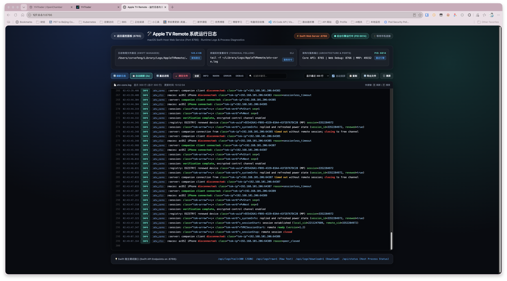
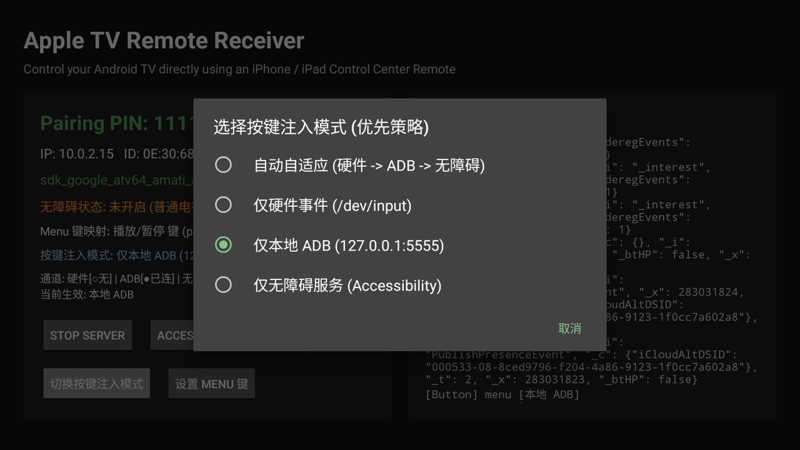
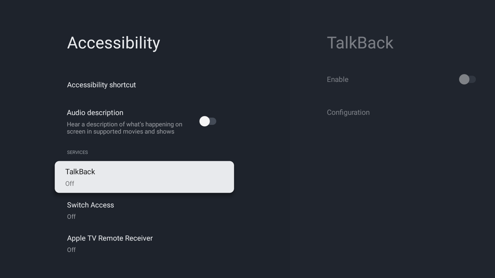
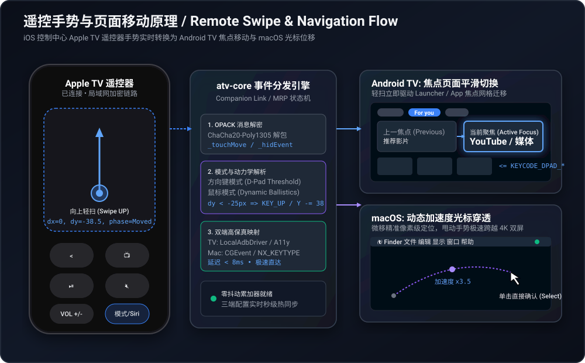
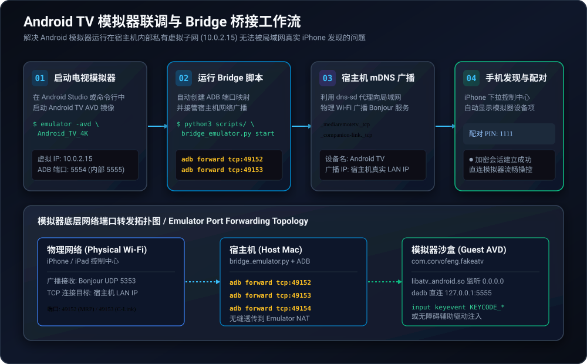

# Fake Apple TV (atv-core) 📺

> [English Version](README.md) | **中文版本**

高性能 Rust 实现的 Apple TV Companion Link / MRP 协议服务端。无需越狱或特殊硬件，即可将真实 Apple 设备（iPhone / iPad 控制中心 **Apple TV 遥控器**）直接发现、配对并遥控：

1. **macOS (Mac mini / MacBook / iMac)**:
   - 原生 Swift 菜单栏 App (`AppleTVRemote.app`) 与跨平台 CLI。
   - 支持**超流畅自适应动态加速度鼠标光标**与**方向键**双模式无缝切换，原生联动系统多媒体键与硬件音量。
   - 内置 Web 交互控制台 (**Web Inspector**) 与 **Swift Host 系统诊断日志**面板，实时可视化触摸板轨迹、硬件音量与毫秒级会话流。
2. **Android TV / Google TV / 电视盒子 / 模拟器**:
   - **原生 APK 独立运行**: 基于 JNI + 本地 ADB (`dadb`) + 无障碍辅助服务 (`AtvAccessibilityService`) 驱动，电视开机自启，独立对外广播。
   - **远程网络 ADB 模式**: 由 Mac mini / PC 运行服务端，通过网络 ADB 实时向电视转发按键与手势。

---

## 目录

- [一、实际界面与实操体验展示](#一实际界面与实操体验展示)
  - [1. macOS & iOS 实机交互界面](#1-macos--ios-实机交互界面)
    - [① iOS 遥控器直连 macOS](#-ios-遥控器直连-macos)
    - [② macOS 浏览器实时控制面板 (Web Inspector at 8765)](#-macos-浏览器实时控制面板-web-inspector-at-8765)
    - [③ macOS Swift 宿主系统运行日志与诊断 (Port 8766)](#-macos-swift-宿主系统运行日志与诊断-port-8766)
    - [④ macOS 原生菜单栏 App 与按键特性](#-macos-原生菜单栏-app-与按键特性)
  - [2. Android TV 实机界面与操作体验](#2-android-tv-实机界面与操作体验)
    - [① 控制看板与功能配置](#-控制看板与功能配置)
    - [② 电视桌面手势与焦点移动体验](#-电视桌面手势与焦点移动体验)
- [二、前置条件与核心权限核对指南（必读）](#二前置条件与核心权限核对指南必读)
  - [1. macOS 关键前置要求与签名授权](#1-macos-关键前置要求与签名授权)
  - [2. Android TV 关键前置要求](#2-android-tv-关键前置要求)
  - [3. 局域网配对网络要求](#3-局域网配对网络要求)
- [三、快速上手与操作指南](#三快速上手与操作指南)
  - [1. macOS 端安装与运行](#1-macos-端安装与运行)
  - [2. Android TV 端安装与运行](#2-android-tv-端安装与运行)
  - [3. Android 模拟器联调与 Bridge 桥接步骤](#3-android-模拟器联调与-bridge-桥接步骤)
- [四、核心实现原理与系统架构](#四核心实现原理与系统架构)
  - [1. 触摸板手势与焦点移动算法原理](#1-触摸板手势与焦点移动算法原理)
  - [2. 模拟器网络通信与 mDNS 拓扑架构](#2-模拟器网络通信与-mdns-拓扑架构)
  - [3. 权限安全与驱动调度架构](#3-权限安全与驱动调度架构)
- [五、按键与手势映射速查表](#五按键与手势映射速查表)
- [六、常见问题排查 (FAQ)](#六常见问题排查-faq)

---

## 一、实际界面与实操体验展示

### 1. macOS & iOS 实机交互界面

#### ① iOS 遥控器直连 macOS
无需在 iPhone / iPad 上安装任何第三方 App，下拉 iOS 控制中心打开原生「Apple TV 遥控器」，即可直接发现局域网内的 Mac（如下图所示，直接连接至 `Yuhao's MacBook (2)`）：

<div align="center">
  
</div>

* **原生触控板操作**：大面积触控区域支持单指微移、快速轻扫与边缘手势。
* **物理按键无缝映射**：
  * **播放/暂停 (`⏯`)**：原生联动系统媒体播放控制。
  * **返回键 (`<`)**：映射为 macOS `Escape` 键。
  * **电视键 (`TV`)**：一键切换或触发全局动作。
  * **音量加减 / 静音**：iPhone 侧边实体音量键直接联动 Mac 硬件音量并呼出原生音量 HUD。
  * **侧边语音/Siri 键**：一键热切换「光标模式」与「方向键模式」。

---

#### ② macOS 浏览器实时控制面板 (Web Inspector at 8765)
在 macOS 上启动服务后，浏览器直接访问 **`http://127.0.0.1:8765`**，即可开启可视化交互诊断面板（下图为实际使用时捕获的手势滑动轨迹与状态）：


* **触摸轨迹实时绘制**：在 Canvas 画布上毫秒级呈现手指位移轨迹点、手势阶段（Began、Moved、Ended）与移动矢量。
* **交互式虚拟遥控器**：无需拿起手机，在网页端直接点击按键即可触发 Mac 响应，调试极度便捷。
* **灵敏度与加速度动力学预设**：支持 `0.5x 慢速精准`、`1.0x 标准`、`1.5x 快速`、`2.2x 极速大屏` 档位切换与自定义调校。
* **实时遥控器连接状态与音量仪表**：可视化显示当前已连接的设备信息与音量分贝/百分比。

---

#### ③ macOS Swift 宿主系统运行日志与诊断 (Port 8766)
在浏览器中访问 **`http://127.0.0.1:8766`**，可直观查看 Swift Host 进程状态与完整的协议会话日志：



* **真实设备会话生命周期**：实时跟踪 iPhone Companion 客户端（如 `192.168.101.206`）接入、SRP 认证协商与 MRP 加密控制信道建立过程。
* **运维与进程管理**：直观展示核心 API 端口（8765）、Web 调试端口（8766）、MRP 端口（49152）及后端进程 PID，支持日志关键词过滤、实时 Follow 与一键重载。

---

#### ④ macOS 原生菜单栏 App 与按键特性
运行原生 `AppleTVRemote.app` 后，常驻 macOS 顶部菜单栏，内存占用仅 18MB：

* **光标 / 方向键热切换**：
  * **鼠标光标模式**：集成动态人体工学加速度曲线，微移精准点选，轻划穿透多显示器。
  * **方向键模式**：精准触发 `↑` `↓` `←` `→` 与回车。
  * **切换方式**：按下遥控器侧边 **Siri / 语音键**，或者在 Web 控制面板点击一键切换，Mac 屏幕会自动弹出原生 Notification 横幅提示！
* **深度多媒体键映射**：
  * **单击 ⏯ 键**：播放 / 暂停（系统原生媒体键，适配 Bilibili、YouTube、Safari、Spotify、IINA 等）。
  * **双击 ⏯ 键**：下一曲（Next Track ⏭）。
  * **三击 ⏯ 键**：上一曲（Previous Track ⏮）。
  * **音量加/减/静音**：硬件级音量 HUD 联动。

---

### 2. Android TV 实机界面与操作体验

#### ① 控制看板与功能配置
直接在 Android TV 屏幕上打开应用，可以直观查看所有底层通道就绪状态，并自由定制按键策略：

| 控制中心主仪表板 | 按键注入模式选择 | Menu 键自定义映射 |
| :---: | :---: | :---: |
|  |  |  |

* **三通道就绪状态检测**：实时检测硬件直连驱动 (`/dev/input/event*`)、本地 Dadb 守护进程 (`127.0.0.1:5555`) 以及无障碍辅助服务 (`AtvAccessibilityService`)。
* **按键注入优先策略**：支持自由选择「仅本地 ADB」、「仅无障碍服务」、「ADB 优先 (无障碍兜底)」或「硬件优先」。
* **Menu 键自定义映射**：适配各类电视应用，可将遥控器的「播放/暂停」、「Home」或「静音」键自由重映射为 Android 系统的 `KEYCODE_MENU`。

---

#### ② 电视桌面手势与焦点移动体验
在 Android TV / Google TV 桌面或应用中，滑动 iPhone 遥控器的触摸板区域，会实时映射为电视界面的焦点网格平移：

```
[顶部标签导航 (For you / Apps)]
              ↕ (手势向下轻扫)
[巨幅内容海报聚焦 (Hero Banner)]
              ↕ (手势向下轻扫)
[应用启动底栏 (YouTube / VLC / 设置)]
```

| 1. 初始聚焦顶部导航 | 2. 向下滑动聚焦主推荐位 | 3. 继续下滑移动至应用卡片 |
| :---: | :---: | :---: |
|  |  |  |

* **轻触或按下中心 SELECT**：直接打开当前聚焦的卡片或播放视频。
* **按返回键 `<`**：退回上一级页面。
* **按电视图标 `Home`**：一键瞬时切回系统主页桌面。

---

## 二、前置条件与核心权限核对指南（必读）

为了保障按键与触控能顺利注入系统，请在首次运行前核对以下系统设置与权限：


### 1. macOS 关键前置要求与签名授权

#### ① 解决 Gatekeeper 拦截（接受自签名证书）
本项目 Release 预编译包使用开发者专属自签名证书 (`Corvo Development`) 签名。在非构建 Mac 上首次运行时，macOS Gatekeeper 会提示「无法验证此 App 不包含恶意软件」。

请选择以下任意一种方式放行：

* **方式 A（推荐，一劳永逸）**：导入项目内置自签名证书至系统钥匙串：
  ```bash
  ./scripts/import_certificate.sh Corvo_Development.p12
  ```
* **方式 B（快捷单机跳过）**：移除应用的隔离扩展属性：
  ```bash
  xattr -dr com.apple.quarantine /Applications/AppleTVRemote.app
  ```
  *或者：在 Finder 中找到该 App，按住 `Control` 键点击图标，选择「打开」，在二次确认框中点击「打开」。*

#### ② 授予「辅助功能」权限
模拟全局键盘敲击与平滑鼠标移动需要 macOS 系统的辅助功能权限：
1. 打开 **系统设置 -> 隐私与安全性 -> 辅助功能**。
2. 确保勾选允许 **AppleTVRemote**（若使用命令行调试，则勾选终端应用如 **Terminal** 或 **iTerm**）。

---

### 2. Android TV 关键前置要求

#### ① 必须开启「网络 ADB 调试」与「USB 调试」
* **为什么必须开启 ADB？**
  * Android 电视为了安全，普通第三方应用无法在全局任意界面（包括桌面、其他影视 App）模拟物理方向键与点击。
  * 本应用内置专有的 Dadb 高性能驱动，会在后台通过本地回环地址直连 `127.0.0.1:5555`，直接向系统底层直接派发事件，达到 **<8ms 极低延迟**的丝滑操控。若关闭 ADB，将无法派发底层物理按键！
* **开启步骤**：
  1. 打开电视 **系统设置 -> 关于 (About)**。
  2. 连续点击 **内部版本号 (Build Number)** 7 次，直到屏幕提示「您现在处于开发者模式」。
  3. 返回上一级菜单，进入 **系统 -> 开发者选项 (Developer Options)**。
  4. 开启 **USB 调试 (USB Debugging)** 以及 **网络 ADB 调试 (Network Debugging)**。

#### ② 必须接受系统 ADB 指纹授权与签名
首次启动应用连接本地 ADB 时，Android TV 屏幕上会弹出系统级安全对话框：

> ⚠️ **极为关键**：
> 请务必使用电视遥控器**勾选「始终允许来自此计算机 (Always allow from this computer)」**，然后点击 **「允许 / OK」**。
> 如果误点了取消或拒绝，本地驱动将提示 `Unauthorized`，遥控将无法生效。

#### ③ 开启无障碍服务权限 (Accessibility Service)
* **作用**：提供全局系统返回键 (`GLOBAL_ACTION_BACK`)、主页键 (`GLOBAL_ACTION_HOME`) 与电源弹窗，并在未开启 ADB 时作为备用兜底通道。
* **开启步骤**：
  1. 在电视应用主页点击 **「ACCESSIBILITY SETTINGS」** 按钮。
  2. 在系统列表中找到 **Apple TV Remote Receiver**（默认显示 Off）。
  3. 点击进入，选择开启，在系统弹出的确认窗口中点击 **OK / 确定** 允许权限。

| 步骤 1: 辅助功能列表 | 步骤 2: 授权确认弹窗 | 步骤 3: 授权生效状态 |
| :---: | :---: | :---: |
|  |  |  |

---

### 3. 局域网配对网络要求

1. **同一 Wi-Fi 子网**：iPhone / iPad 与 Android TV / Mac 必须接入同一个局域网路由器（2.4G / 5G 频段可互通）。
2. **禁止 AP 隔离**：部分商用路由器开启了「AP 隔离 (Client Isolation)」，会导致设备间无法收发 mDNS (Bonjour UDP 5353) 广播包。请确保路由器允许局域网组播与设备间互访。
3. **初次配对 PIN 码**：iPhone 控制中心点击设备后，电视或终端会展示 4 位验证码，在手机上输入 **`1111`** 即可完成 SRP 握手。

---

## 三、快速上手与操作指南

### 1. macOS 端安装与运行

```bash
# 一键打包原生 DMG 安装包
./scripts/build_dmg.sh
```

打开生成的 `build/AppleTVRemote-arm64.dmg`，将应用拖拽到 `/Applications` 即可运行。运行后在菜单栏找到图标，即可开始使用。

---

### 2. Android TV 端安装与运行

```bash
# 编译并安装 APK 到连接的电视或盒子
./scripts/build_android.sh
adb install -r android-tv/app/build/outputs/apk/debug/app-debug.apk

# 启动应用
adb shell am start -n com.corvofeng.fakeatv/.MainActivity
```

---

### 3. Android 模拟器联调与 Bridge 桥接步骤

如果你手头没有物理 Android 电视，可以使用 Android Studio 内置的 Android TV 模拟器（AVD）进行体验：

#### 第一步：启动 Android TV 模拟器
在 Android Studio Device Manager 中启动任意 Android TV / Google TV 镜像（推荐 Android 11+ / API 30+），运行 `adb devices` 确认设备已挂载（通常为 `emulator-5554`）。

#### 第二步：安装并启动 TV 接收端
```bash
./scripts/build_android.sh
adb -s emulator-5554 install -r android-tv/app/build/outputs/apk/debug/app-debug.apk
adb -s emulator-5554 shell am start -n com.corvofeng.fakeatv/.MainActivity
```

#### 第三步：启动桥接服务 (Bridge)
```bash
# 启动后台桥接守护进程
python3 scripts/bridge_emulator.py start

# 或前台查看实时日志
python3 scripts/bridge_emulator.py start -f
```

* 常用管理命令：
  ```bash
  python3 scripts/bridge_emulator.py status    # 查看端口转发与 mDNS 广播状态
  python3 scripts/bridge_emulator.py logs -f   # 查看实时桥接日志
  python3 scripts/bridge_emulator.py stop      # 停止桥接守护进程
  ```

#### 第四步：在 iPhone 上配对并操控
1. 确保 iPhone 连接到与 Mac 相同的 Wi-Fi。
2. 下拉 iOS 控制中心，点击「Apple TV 遥控器」图标。
3. 在设备列表中选择 **`Android TV Emulator`**。
4. 输入默认配对码 **`1111`**，即可直接在大屏幕模拟器上遥控翻页！

---

## 四、核心实现原理与系统架构

### 1. 触摸板手势与焦点移动算法原理

当你在 iPhone 控制中心轻扫滑屏时，系统通过 TLS 加密的 Companion Link 协议发送高频触控微积分坐标。`atv-core` 解析协议后，在 Android TV 上转换为网格焦点平滑移动，在 macOS 上则转换为带人体工学加速度曲线的光标平移：



1. **手势积分累加器 (Delta Accumulator)**：在高频手势滑动事件中平滑累加位移，有效消除抖动与偶发误触。
2. **方向死区与灵敏度判定 (Direction Deadzone)**：通过动态死区门限判断滑动意图（水平 vs 垂直），防止对角线误判。
3. **平台分发调度**：
   - **Android TV**：触发 `KEYCODE_DPAD_UP/DOWN/LEFT/RIGHT` 网格焦点迁移。
   - **macOS**：结合时间差计算速度与加速度曲线，通过 macOS `CGEvent` 派发丝滑光标位移。

---

### 2. 模拟器网络通信与 mDNS 拓扑架构

由于 Android 模拟器运行在宿主机内部的虚拟 NAT 子网（虚拟 IP 固定为 `10.0.2.15`），外界的局域网物理设备无法直接通过局域网广播发现模拟器：



1. **ADB 端口透传**：将宿主机物理端口 (`49152`, `49153`, `49154`) 通过 `adb forward` 无缝穿透到模拟器内部。
2. **mDNS 代理广播**：宿主机接管 Bonjour 广播通道，代表模拟器向 Wi-Fi 物理局域网宣告 `_mediaremotetv._tcp` 与 `_companion-link._tcp` 服务。
3. **无感直连**：iPhone 在控制中心看到的设备即为运行在 Mac 上的 Android TV 模拟器。

---

### 3. 权限安全与驱动调度架构

为了确保低延迟与高鲁棒性，`atv-core` 设计了分层驱动调度体系：


* **Android 端**：
  * **第一优先级 (Dadb)**：本地环回直连 `127.0.0.1:5555`，直接派发 Linux Input Keycode，延迟 `<8ms`。
  * **第二优先级 (Accessibility)**：无障碍辅助服务兜底，处理 `GLOBAL_ACTION_BACK` 等全局窗体操作。
* **macOS 端**：
  * **Accessibility API (`CGEvent`)**：驱动系统级键鼠事件与加速度光标。
  * **CoreAudio / MediaRemote Framework**：原生联动系统硬件音量与多媒体控制中心。

---

## 五、按键与手势映射速查表

| Apple TV 遥控器手势 / 按键 | Android TV (物理电视 / 模拟器) | macOS (Mac mini / MacBook) |
| :--- | :--- | :--- |
| **滑动触摸板 (方向模式)** | `KEYCODE_DPAD_UP` / `DOWN` / `LEFT` / `RIGHT` | 方向键 `↑` `↓` `←` `→` |
| **滑动触摸板 (鼠标模式)** | 模拟触摸拖拽 / 光标滑动 | 本地坐标累加器平滑光标 (`CGEvent`) |
| **轻触 / 点击 SELECT** | `KEYCODE_DPAD_CENTER` / 点击确认 | 回车键确认 (Enter) / 鼠标左键单击 |
| **返回键 (`<`)** | `GLOBAL_ACTION_BACK` / 返回上一级 | `Escape` 键 |
| **电视图标 (`Home`)** | `GLOBAL_ACTION_HOME` / 回到桌面 | 回到桌面 / 用户自定义快捷键 |
| **单击 ⏯** | `KEYCODE_MEDIA_PLAY_PAUSE` | 原生播放/暂停 (`NX_KEYTYPE_PLAY`) |
| **双击 ⏯** | 下一集 / 媒体快进 | 下一曲 (Next Track ⏭) |
| **三击 ⏯** | 上一集 / 媒体快退 | 上一曲 (Previous Track ⏮) |
| **音量加 / 减 (`+/-`)** | `KEYCODE_VOLUME_UP` / `DOWN` | 硬件主输出音量调节 + 原生 HUD |
| **静音键 (`Mute`)** | `KEYCODE_VOLUME_MUTE` | 系统一键静音 |
| **侧边 Siri 键** | 语音搜索 (`KEYCODE_SEARCH`) | 模式热切换 (鼠标 ⇄ 方向键) 或唤醒 Siri |
| **电源键 (`Power`)** | 电源休眠对话框 (`GLOBAL_ACTION_POWER_DIALOG`) | 屏幕睡眠 / 唤醒 |

---

## 六、常见问题排查 (FAQ)

### Q1: iPhone 控制中心找不到设备？
1. 检查 iPhone 与运行设备是否在同一个 Wi-Fi 网络下（避免一个连接 5G、另一个连接 2.4G 访客网络且开启了隔离开关）。
2. 在 Mac 终端运行 `dns-sd -B _mediaremotetv._tcp`，检查是否能正常发现本机的 Bonjour 广播。
3. 如果是 Android 模拟器，确保已运行 `python3 scripts/bridge_emulator.py start`。

### Q2: 电视上按键无反应，Live Log 提示 ADB 连接失败？
1. 请进入电视「开发者选项」，确认已打开「网络调试 (Network ADB)」与「USB 调试」。
2. 重启一次 TV 应用，密切留意电视屏幕中央，是否出现了 RSA 安全指纹授权弹窗。**必须勾选「始终允许」并点确定**。
3. 如果电视系统无原生弹窗，可以在电脑终端执行 `adb connect <电视IP>:5555` 进行首次电脑端信任。

### Q3: 为什么电视端安装后系统设置里找不到「无障碍」页面？
部分国内定制化 Android 电视系统阉割了原生设置菜单。可以在主界面点击「ACCESSIBILITY SETTINGS」弹窗查看 ADB 命令，或在电脑终端执行以下命令直接激活：
```bash
adb shell settings put secure enabled_accessibility_services com.corvofeng.fakeatv/.AtvAccessibilityService
adb shell settings put secure accessibility_enabled 1
```

### Q4: macOS 提示应用损坏或来自不受信任的开发者？
执行以下命令移除 Gatekeeper 隔离限制：
```bash
xattr -dr com.apple.quarantine /Applications/AppleTVRemote.app
```
或运行仓库提供的导入脚本信任自签名证书：
```bash
./scripts/import_certificate.sh Corvo_Development.p12
```

---

## 许可证 (License)

本项目采用 MIT 许可证开源。仅供技术学习与局域网设备互通研究使用。
